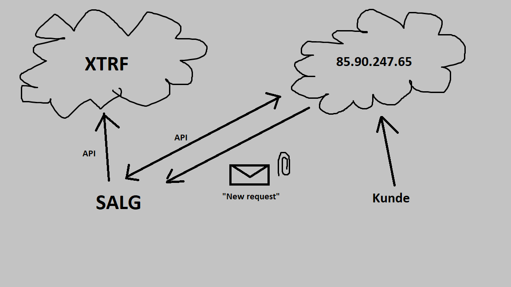
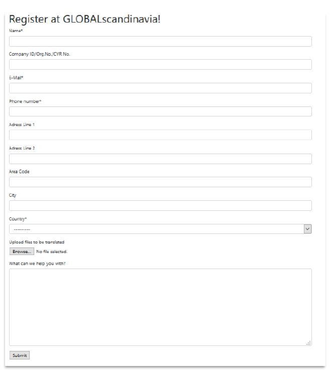
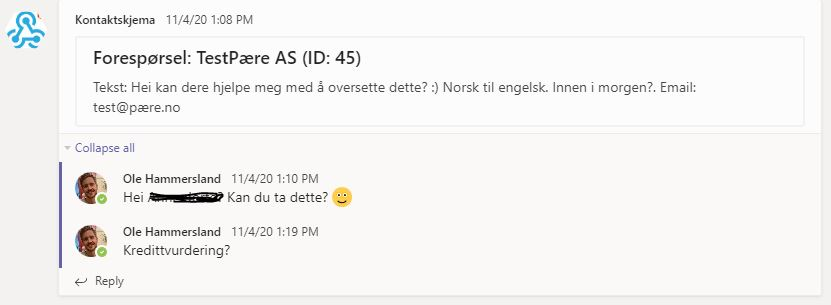

# Automatically registering clients on the XTRF translation system

### Why?
Working as a sales person at a translation agency, I recieved numerous requests from potential clients requesting a quote. The requests are usually sent to a large number of agencies in order for them to compare prices. Sending these probably didn't take the potential clients very long. However, I found that registering them in XTRF so that I could prepare a quote ended up eating up a lot of my time.

XTRF is a nice enough TMS (Translation Management System), but it's heavy: with a lot of menus. Most of the time, you end up entering the same information for everyone. So why not automate the process?

### Gathering information
Interestingly enough, most potential clients went through our web page in order to request a quote. There, they would be able to enter their basic contact information along with their request. I would then register them as a new client in the XTRF database, drawing on online sources to find the missing pieces. Especially the organization number or CSV-number, which is needed for tax reasons.

In my new project, I would allow the clients to simply enter this information themselves. The tax number (organization number in Sweden/Norway, CVR in Denmark) is the most important piece of information. Depending on which Scandinavian country the company was from, I would know what else to set up when registering them to the XTRF database: project managers, invoicing settings, responsible sales person, etc.

Of course, it would also be nice to keep all the not so serious-sounding clients out of our XTRF database. I came up with a simple architecture looking something like this:



Here, the clients could interact with our web page (represented by the IP adress in the illustration). The sales team ("Salg") would recieve a notification, and choose whether to subsequently transfer the information from the web page into the main XTRF database.

By first having the potential clients enter their information into an intermediary database, my translation agency would be able to screen the requests before choosing to automatically registering them on XTRF. That's good, as we'd get a lot of requests for smaller translation jobs, two-pagers like CVs and diplomas, which wasn't something we as a B2B translation agency would do. 

A more prominent reason for this architecture is also simply the fact that I was learning Django at the time. I thought this would be a good opportunity to make use of the [Django REST API framework](https://www.django-rest-framework.org/). I quickly built a very simple pilot web site containing only one form in the frontend. 



Here, the potential clients would be able enter their information and write a short message to request a quote.
This form was linked to the following Django model:

```
class Company(models.Model):
    name = models.CharField(max_length=300, verbose_name="Name")
    publish_date = models.DateTimeField(auto_now=True)
    adressLine1 = models.CharField(max_length=200, verbose_name="Adress Line 1")
    adressLine2 = models.CharField(blank=True, max_length=200, verbose_name="Adress Line 2")
    area_code = models.CharField(blank=True, max_length=200, verbose_name="Area Code")
    email = models.EmailField(verbose_name="E-Mail")
    phone_number = models.CharField(max_length=200, verbose_name="Phone Number")
    city = models.CharField(blank=True, max_length=200, verbose_name="City")
    country_id = models.ForeignKey(Country, on_delete=models.CASCADE, verbose_name="Country")
    idNumber = models.CharField(blank=True, max_length=30, verbose_name="Company ID/Org.No./CVR No.")
    document = models.FileField(blank=True, upload_to='documents/', verbose_name="Upload Files that need translating")
    freetext = models.TextField(blank=True, verbose_name="What can we help you with?")

    def __str__(self):
        return self.name

    def get_absolute_url(self):
        return "success/"

```
A Django model defines the database fields for the table which is connected to the web page form. When the user submits the form, the information is organized and stored in the corresponding fields of that database table (sort of like an Excel spreadsheet).
As you might tell from the model, the potential client would also be able to directly upload the file he or she wanted translated.

### Registering
When someone entered the above information to request a quote, all the information was stored on the database of my Django site. It was then accessible via the Django REST API in JSON format.

I would get an email from the server informing me of the request. Also, my team would recieve a message on [Teams through a connector](https://docs.microsoft.com/en-us/microsoftteams/platform/webhooks-and-connectors/how-to/connectors-using), which would allow us to directly discuss the request.



If we deemed the request as serious, we would run the python script **add_client.py**, using the ID of the request as an argument, i.e. `python3 add_client.py 23`. The script downloaded the information from the Django API and instantly uploaded it to the XTRF database through the [Home Portal API](https://www.xtrf.eu/xtrf-api-doc/home-api).

### To test the Django site

Install something similar to the requirements in **requirements.txt**. 
Go into the client_registration folder, migrate the database and run the test server.
Add a super user so that you will be able to log in to the admin and API panels.
```
cd client_registration
python3 manage.py makemigrations
python3 manage.py makemigrations registration_app
python3 manage.py migrate
python3 manage.py createsuperuser
python3 manage.py runserver
```
Go to localhost:8000 and try adding someone to your database. You should see the company you added on localhost:8000/api/companies

To review the email and Teams-functionality, check out the commented out code in **client_registration/registration_app/views.py**

### To sum up
This was a fun "proof-of-concept". XTRF is a very big TMS that aims to satisfy every thinkable need. For us, the translation business is mostly fast-moving and fluid. Why invest too much time in a potential client when the likelihood of them picking one of the fifteen other agencies they contacted is so high?

Advantages of automating client registration in XTRF:
* Instantanous registration within seconds
* All standard fields entered correctly based on country
* No danger of spam, as the client go through an intermediate server
* Teams integration – better communication!